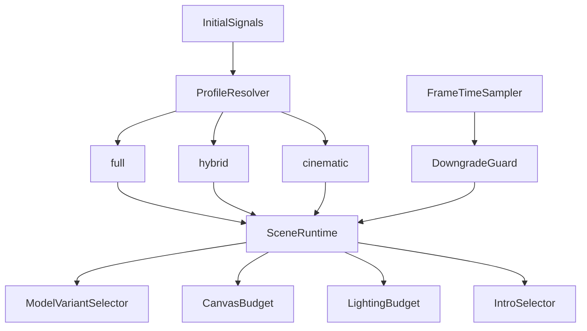

# Adaptive Performance Experience Plan

## Goal

Preserve immersion and atmosphere by delivering different render paths per device/runtime budget, instead of forcing full realtime on all hardware.

## Core Principle

Do not optimize for maximum realtime rendering. Optimize for emotional continuity: stable motion, coherent lighting mood, and seamless transitions.

## Experience Tiers

- `full`: richest realtime path for strong devices.
- `hybrid`: mixed path (lighter realtime + baked/cinematic elements) for mid devices.
- `cinematic`: most stable path for weak/thermally constrained devices, with stronger reliance on pre-rendered assets.

## What To Precompute And Preload

### Precompute (offline/baked)
- Lightmaps for static geometry.
- Ambient occlusion textures for static assets.
- Static shadow bakes/contact shadow decals.
- Reflection environment maps/probes.
- Cinematic intro camera path as video.

### Preload (runtime)
- Keep current GLB preloading pipeline and extend it per tier.
- Preload tier-relevant model variants only.
- Keep shader warmup pass for expected camera presets.

Relevant existing hooks:
- [`src/presentation/Scene/Model/Model.tsx`](/Users/shirzabolotny/Documents/code/mountain/src/presentation/Scene/Model/Model.tsx)
- [`src/presentation/Scene/ShaderWarmup/ShaderWarmup.tsx`](/Users/shirzabolotny/Documents/code/mountain/src/presentation/Scene/ShaderWarmup/ShaderWarmup.tsx)

## Low-Quality Model Strategy (LOD/Variants)

### Asset strategy
- Create model variants for heavy assets: `*_high.glb`, `*_med.glb`, `*_low.glb`.
- Start with foliage and dense decor first (highest count, lowest interaction value).
- Keep hero interactive assets at higher quality longer.

### Runtime selection
- Select variant paths from profile config before preload/render.
- In lower tiers, mount `criticalObjects` first and gate `decorativeObjects`.

Primary integration points:
- [`src/presentation/Scene/config/sceneObjects.ts`](/Users/shirzabolotny/Documents/code/mountain/src/presentation/Scene/config/sceneObjects.ts)
- [`src/presentation/Scene/Scene.tsx`](/Users/shirzabolotny/Documents/code/mountain/src/presentation/Scene/Scene.tsx)

## Exact Device Detection Plan

### Stage 1: Initial classification (cheap and immediate)
Use current signals plus capability hints:
- user agent + viewport width (already implemented),
- `navigator.deviceMemory` (if available),
- `navigator.hardwareConcurrency`,
- Safari/iOS heuristic defaults.

Current baseline:
- [`src/shared/device/deviceDetector.ts`](/Users/shirzabolotny/Documents/code/mountain/src/shared/device/deviceDetector.ts)
- [`src/context/device/DeviceProvider.tsx`](/Users/shirzabolotny/Documents/code/mountain/src/context/device/DeviceProvider.tsx)

### Stage 2: Runtime validation (truth from frame-time)
- Sample frame times over rolling windows (for example 1.5-3s).
- If sustained FPS is below threshold, downshift one tier at safe transition points.
- Do not hard switch during major camera transitions.

### Stage 3: Persistence
- Persist resolved profile in local storage per device/session.
- Allow manual user override ("Balanced" / "Immersive"), but keep safe default.

## Rendering Budget By Tier

- `full`
  - DPR cap: `1.75-2.0`
  - Shadows: enabled, higher map sizes
  - Rich decorative density
- `hybrid`
  - DPR cap: `1.25-1.5`
  - Fewer shadow casters, medium map sizes
  - Reduced foliage/particle density
- `cinematic`
  - DPR cap: `1.0-1.25`
  - Minimal realtime shadows
  - Maximum baked/cinematic substitution

Key files to gate:
- [`src/presentation/Scene/Scene.tsx`](/Users/shirzabolotny/Documents/code/mountain/src/presentation/Scene/Scene.tsx)
- [`src/presentation/Scene/Lighting/Lighting.tsx`](/Users/shirzabolotny/Documents/code/mountain/src/presentation/Scene/Lighting/Lighting.tsx)
- [`src/presentation/Scene/config/sceneDensity.ts`](/Users/shirzabolotny/Documents/code/mountain/src/presentation/Scene/config/sceneDensity.ts)

## Hybrid Intro Flow

- Keep realtime intro for `full`.
- Add pre-rendered intro video path for `cinematic` (optional for `hybrid`).
- Match end video camera pose to first interactive camera preset.
- Crossfade video -> canvas in 250-400ms to hide seam.

Integration points:
- [`src/presentation/Scene/IntroAnimation/IntroAnimation.tsx`](/Users/shirzabolotny/Documents/code/mountain/src/presentation/Scene/IntroAnimation/IntroAnimation.tsx)
- [`src/presentation/Scene/LoaderOverlay/LoaderOverlay.tsx`](/Users/shirzabolotny/Documents/code/mountain/src/presentation/Scene/LoaderOverlay/LoaderOverlay.tsx)

## Rollout Order

1. Add profile config and tier budgets.
2. Wire profile to Canvas and Lighting.
3. Split scene objects into critical/decorative and gate by tier.
4. Add runtime frame-time governor and gentle downshift.
5. Add cinematic intro path and camera-matched handoff.
6. Validate on iPhone 12 class, older laptop iGPU, modern desktop GPU.

## Architecture Sketch

