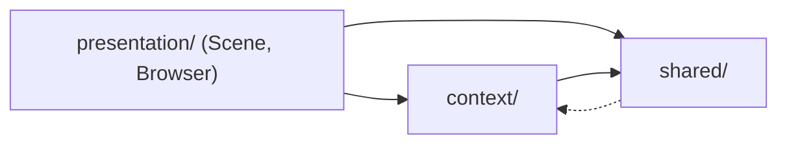

# DDD Alignment Plan

Feature-based layout. No `domain/`, `application/`, or `infrastructure/` folders.
Everything scene → `presentation/Scene/`. Everything portfolio → `presentation/Browser/`.
Cross-feature state → `context/`. Cross-feature utilities → `shared/`.

---

## 1. Target Hierarchy

```
src/
│
├── main.tsx
├── App.tsx
├── App.css
├── index.css
├── svg.d.ts
│
├── context/                                    # cross-feature state (split god object)
│   ├── scene/
│   │   ├── SceneContext.tsx
│   │   ├── SceneProvider.tsx
│   │   ├── useSceneContext.ts
│   │   └── types.ts                            # SceneState, SceneAction
│   ├── portfolio/
│   │   ├── PortfolioContext.tsx
│   │   ├── PortfolioProvider.tsx
│   │   ├── PortfolioContextBridge.tsx          # only bridge that crosses R3F <Html> portal
│   │   ├── usePortfolioContext.ts
│   │   └── types.ts                            # PortfolioState, BrowserMode enum
│   └── device/
│       ├── DeviceContext.tsx
│       ├── DeviceProvider.tsx
│       ├── useDeviceContext.ts
│       └── types.ts                            # DeviceType enum
│
├── shared/
│   ├── components/
│   │   ├── ErrorBoundary/
│   │   │   ├── ErrorBoundary.tsx
│   │   │   ├── ErrorBoundary.css
│   │   │   └── types.ts
│   │   └── Icon/
│   │       ├── Icon.tsx
│   │       ├── Icon.css
│   │       └── types.ts
│   ├── i18n/
│   │   ├── translations/
│   │   │   ├── en.json
│   │   │   └── he.json
│   │   ├── useTranslation.ts
│   │   ├── Language.ts                         # enum + isRTL(), displayName()
│   │   └── types.ts                            # TextStructure, LanguageType
│   └── device/
│       ├── deviceDetector.ts                   # pure detectDevice, isMobileDevice
│       ├── breakpoints.ts                      # UA patterns, viewport thresholds
│       └── types.ts                            # DeviceDetectionResult
│
└── presentation/                               # renamed from components/
    │
    ├── Scene/                                  # EVERYTHING 3D
    │   ├── Scene.tsx
    │   ├── Scene.css
    │   ├── types.ts                            # Position3D, CameraPreset, PresetKey,
    │   │                                       # SceneObject, IntroChoreography, RenderHints
    │   ├── config/
    │   │   ├── positions.ts                    # raw constants → Position3D instances
    │   │   ├── sceneObjects.ts                 # MODEL_CONFIG as SceneObject[]
    │   │   ├── cameraPresets.ts                # CAMERA_PRESETS
    │   │   ├── introChoreography.ts            # orbit pts, durations, phaseAt()
    │   │   ├── renderPolicy.ts                 # NO_SHADOW_PATHS, emissive rules
    │   │   └── sceneDensity.ts                 # butterfly/plant count per device
    │   ├── adapters/
    │   │   └── toThreeTypes.ts                 # Position3D→Vector3, CameraPreset→OrbitControls
    │   ├── hooks/
    │   │   ├── useOpenPortfolio.ts             # stopIntro + moveCamera + openBrowser
    │   │   └── useChangeCameraPreset.ts
    │   │
    │   ├── Model/
    │   │   ├── Model.tsx
    │   │   ├── Model.css
    │   │   ├── types.ts
    │   │   └── applyMaterialPolicy.ts          # emissive/mountain branches extracted
    │   ├── CameraRig/
    │   │   ├── CameraRig.tsx
    │   │   ├── CameraTracker.tsx
    │   │   ├── CameraRig.css
    │   │   └── types.ts
    │   ├── IntroAnimation/
    │   │   ├── IntroAnimation.tsx
    │   │   ├── IntroAnimation.css
    │   │   └── types.ts
    │   ├── SceneButton3D/
    │   │   ├── SceneButton3D.tsx
    │   │   ├── SceneButton3D.css
    │   │   └── types.ts
    │   ├── CodeOnMonitors/
    │   │   ├── CodeOnMonitors.tsx
    │   │   ├── CodeOnMonitors.css
    │   │   └── types.ts
    │   ├── Lighting/
    │   │   ├── Lighting.tsx
    │   │   ├── Lighting.css
    │   │   └── types.ts
    │   ├── LoaderOverlay/
    │   │   ├── LoaderOverlay.tsx
    │   │   ├── LoaderOverlay.css
    │   │   └── types.ts
    │   └── ShaderWarmup/
    │       ├── ShaderWarmup.tsx
    │       └── types.ts
    │
    └── Browser/                                # EVERYTHING portfolio
        ├── Browser.tsx
        ├── Browser.css
        ├── types.ts                            # BrowserMode, SectionId, AnimationConfig, Section
        ├── config.ts                           # SECTIONS, ANIMATION_CONFIG, UI_TIMING_CONFIG
        ├── hooks/
        │   ├── useHtmlReady.ts
        │   └── useClosePortfolio.ts            # fixes windowState bug
        │
        ├── BrowserHeader/
        │   ├── BrowserHeader.tsx
        │   ├── BrowserHeader.css
        │   └── types.ts
        │
        ├── Navigation/
        │   ├── Navigation.tsx
        │   ├── Navigation.css
        │   ├── types.ts                        # NavigationItem
        │   ├── hooks/
        │   │   ├── useScrollNavigation.ts      # DOM scroll only
        │   │   ├── useScrollVisibility.ts
        │   │   ├── useScreenVisibility.ts
        │   │   └── useNavigateToSection.ts
        │   ├── services/
        │   │   └── computeActiveSection.ts     # pure scoring logic
        │   │
        │   └── LanguageSwitcher/
        │       ├── LanguageSwitcher.tsx
        │       ├── LanguageSwitcher.css
        │       ├── types.ts
        │       └── hooks/
        │           ├── useLanguageDropdown.ts
        │           └── useSwitchLanguage.ts
        │
        └── Sections/
            ├── WebsiteSection/
            │   ├── WebsiteSection.tsx
            │   └── types.ts
            ├── Overview/
            │   ├── Overview.tsx
            │   ├── Overview.css
            │   └── types.ts
            ├── About/
            │   ├── About.tsx
            │   ├── About.css
            │   └── types.ts
            ├── Service/
            │   ├── Service.tsx
            │   ├── Service.css
            │   └── types.ts
            └── Contact/
                ├── Contact.tsx
                ├── Contact.css
                ├── types.ts                    # ContactLinkConfig, WhatsAppConfig, EmailConfig,
                │                                # GoogleCalendarConfig, PhoneNumber, EmailAddress
                ├── config.ts                   # CONTACT_LINKS_CONFIG, CONTACT_CONFIG
                ├── hooks/
                │   └── useContactLinks.ts
                └── services/
                    ├── generateEmailLink.ts
                    ├── generateWhatsAppLink.ts
                    ├── generateCalendarLink.ts
                    ├── meetingScheduler.ts     # getNextBusinessDay, formatGoogleDateTime
                    └── phoneValidator.ts
```

---

## 2. Dependency rules



- `presentation/` → `context/`, `shared/`
- `context/` → `shared/` only
- `shared/` → nothing (leaf)
- `Scene/` and `Browser/` **never** import from each other. They communicate via `context/`.

---

## 3. File relocation map

### Scene
| From | To |
|------|-----|
| `src/components/scene/Scene.tsx` | `presentation/Scene/Scene.tsx` |
| `src/components/scene/Model.tsx` | `presentation/Scene/Model/Model.tsx` |
| `src/components/scene/CameraRig.tsx` (two exports) | `presentation/Scene/CameraRig/CameraRig.tsx` + `CameraTracker.tsx` |
| `src/components/scene/IntroAnimation.tsx` | `presentation/Scene/IntroAnimation/IntroAnimation.tsx` |
| `src/components/scene/SceneButton3D.tsx` | `presentation/Scene/SceneButton3D/SceneButton3D.tsx` |
| `src/components/scene/CodeOnMonitors.tsx` | `presentation/Scene/CodeOnMonitors/CodeOnMonitors.tsx` |
| `src/components/scene/Lighting.tsx` | `presentation/Scene/Lighting/Lighting.tsx` |
| `src/components/scene/LoaderOverlay.tsx` | `presentation/Scene/LoaderOverlay/LoaderOverlay.tsx` |
| `src/components/scene/ShaderWarmup.tsx` | `presentation/Scene/ShaderWarmup/ShaderWarmup.tsx` |
| `src/components/scene/config/camera.ts` → `CameraPreset`, `PresetKey` types | `presentation/Scene/types.ts` |
| `src/components/scene/config/camera.ts` → `CAMERA_PRESETS`, `INITIAL_PRESET` | `presentation/Scene/config/cameraPresets.ts` |
| `src/components/scene/config/camera.ts` → `ORBIT_POINTS`, `ORBIT_TARGET`, `*_DURATION`, `INTRO_DURATION` | `presentation/Scene/config/introChoreography.ts` |
| `src/components/scene/config/models.ts` → `ModelConfig` type | `presentation/Scene/types.ts` (renamed `SceneObject`) |
| `src/components/scene/config/models.ts` → `MODEL_CONFIG` | `presentation/Scene/config/sceneObjects.ts` |
| `src/components/scene/config/models.ts` → `NO_SHADOW_PATHS` | `presentation/Scene/config/renderPolicy.ts` |
| `src/components/scene/config/positions.ts` | `presentation/Scene/config/positions.ts` |
| `Scene.tsx` → `handleOpenBrowser` | `presentation/Scene/hooks/useOpenPortfolio.ts` |
| `Scene.tsx` → preset picker `[{key,label,color}...]` array | `presentation/Scene/config/cameraPresets.ts` (PRESET_BUTTONS) |
| `Model.tsx` → emissive/mountain/background branches | `presentation/Scene/Model/applyMaterialPolicy.ts` |

### Browser
| From | To |
|------|-----|
| `src/components/browser/Browser.tsx` | `presentation/Browser/Browser.tsx` |
| `src/components/browser/BrowserHeader.tsx` | `presentation/Browser/BrowserHeader/BrowserHeader.tsx` |
| `src/components/browser/browser.scss` | `presentation/Browser/Browser.css` (convert) |
| `src/components/browser/types.ts` → `SECTION_IDS`, `SectionIdType`, `SectionConfig`, `AnimationConfig`, `SectionComponent` | `presentation/Browser/types.ts` |
| `src/components/browser/types.ts` → `BROWSER_MODE`, `BrowserModeType` | `context/portfolio/types.ts` |
| `src/components/browser/config.ts` | `presentation/Browser/config.ts` |
| `src/components/browser/useHtmlReady.ts` | `presentation/Browser/hooks/useHtmlReady.ts` |
| `BrowserHeader` close handler | `presentation/Browser/hooks/useClosePortfolio.ts` (+ fix `windowState` bug → `browserMode`) |

### Navigation
| From | To |
|------|-----|
| `browser/navigation/Navigation.tsx` | `presentation/Browser/Navigation/Navigation.tsx` |
| `browser/navigation/navigation.scss` | `presentation/Browser/Navigation/Navigation.css` |
| `browser/navigation/useScrollNavigation.ts` (DOM observer) | `presentation/Browser/Navigation/hooks/useScrollNavigation.ts` |
| `browser/navigation/useScrollNavigation.ts` (scoring math) | `presentation/Browser/Navigation/services/computeActiveSection.ts` |
| `browser/navigation/useScrollVisibility.ts` | `presentation/Browser/Navigation/hooks/useScrollVisibility.ts` |
| `browser/navigation/useScreenVisibility.ts` | `presentation/Browser/Navigation/hooks/useScreenVisibility.ts` |
| `browser/navigation/LanguageSwitcher.tsx` | `presentation/Browser/Navigation/LanguageSwitcher/LanguageSwitcher.tsx` |
| `browser/navigation/languageSwitcher.scss` | `presentation/Browser/Navigation/LanguageSwitcher/LanguageSwitcher.css` |
| `browser/navigation/useLanguageDropdown.ts` | `presentation/Browser/Navigation/LanguageSwitcher/hooks/useLanguageDropdown.ts` |
| `LanguageSwitcher` set-language logic | `presentation/Browser/Navigation/LanguageSwitcher/hooks/useSwitchLanguage.ts` |

### Sections
| From | To |
|------|-----|
| `browser/sections/WebsiteSection.tsx` | `presentation/Browser/Sections/WebsiteSection/WebsiteSection.tsx` |
| `browser/sections/Overview.tsx` + `.scss` | `presentation/Browser/Sections/Overview/Overview.tsx` + `.css` |
| `browser/sections/About.tsx` + `.scss` | `presentation/Browser/Sections/About/About.tsx` + `.css` |
| `browser/sections/Service.tsx` + `.css` | `presentation/Browser/Sections/Service/Service.tsx` + `.css` |
| `browser/sections/Contact.tsx` + `.scss` | `presentation/Browser/Sections/Contact/Contact.tsx` + `.css` |
| `browser/sections/contact-utils/types.ts` | `presentation/Browser/Sections/Contact/types.ts` |
| `browser/sections/contact-utils/config.ts` | `presentation/Browser/Sections/Contact/config.ts` |
| `browser/sections/contact-utils/generateEmailLink.ts` | `presentation/Browser/Sections/Contact/services/generateEmailLink.ts` |
| `browser/sections/contact-utils/generateWhatsAppLink.ts` | `presentation/Browser/Sections/Contact/services/generateWhatsAppLink.ts` |
| `browser/sections/contact-utils/generateCalendarLink.ts` (URL builder) | `presentation/Browser/Sections/Contact/services/generateCalendarLink.ts` |
| `generateCalendarLink.ts` → `getNextBusinessDay`, `getDatesRange`, `formatGoogleDateTime` | `presentation/Browser/Sections/Contact/services/meetingScheduler.ts` |
| `browser/sections/contact-utils/linkValidators.ts` | `presentation/Browser/Sections/Contact/services/phoneValidator.ts` |
| `browser/sections/contact-utils/index.ts` → `generateContactLinks`, `getContactLinks` | `presentation/Browser/Sections/Contact/hooks/useContactLinks.ts` |

### Context
| From | To |
|------|-----|
| `src/context/AppContext.tsx`, `AppProvider.tsx`, `useAppContext.ts` | **DELETE**. Split into: |
| `runIntro`, `cameraPreset` state | `context/scene/` |
| `browserMode`, `visibleSectionIds`, `language` | `context/portfolio/` |
| `device` | `context/device/` |
| `src/context/ContextBridge.tsx` | `context/portfolio/PortfolioContextBridge.tsx` (only one needed) |

### Shared
| From | To |
|------|-----|
| `src/shared/ErrorBoundary.tsx` | `shared/components/ErrorBoundary/ErrorBoundary.tsx` |
| `src/shared/Icon.tsx` | `shared/components/Icon/Icon.tsx` |
| `src/i18n/en.json`, `he.json` | `shared/i18n/translations/` |
| `src/i18n/useTranslation.ts` | `shared/i18n/useTranslation.ts` |
| `src/i18n/types.ts` → `LANGUAGE`, `LanguageType` | `shared/i18n/Language.ts` + `shared/i18n/types.ts` |
| `src/hooks/useDeviceDetection.ts` → `detectDevice`, `isMobileDevice` | `shared/device/deviceDetector.ts` |
| `src/hooks/useDeviceDetection.ts` → context-reading hook + butterfly logic | Split: `context/device/useDeviceContext.ts` + `presentation/Scene/hooks/useButterflyCount.ts` |
| `src/config/device.ts` → `DEVICE`, `DeviceType` | `context/device/types.ts` |
| `src/config/device.ts` → `DEVICE_DETECTION_CONFIG` | `shared/device/breakpoints.ts` |
| `src/config/device.ts` → `DEVICE_CONFIG.butterflyCount` | `presentation/Scene/config/sceneDensity.ts` |

---

## 4. Redundant / dead code to REMOVE

| What | Where | Reason |
|------|-------|--------|
| `ModelConfig.floatSpeed` | `scene/config/models.ts` | Always `0` in 64/64 entries |
| `ModelConfig.floatIntensity` | `scene/config/models.ts` | Always `0` in 64/64 entries |
| `<Float>` wrapper | `scene/Model.tsx` | Always receives 0s — no effect |
| `rotationIntensity={floatSpeed > 0 ? 0.05 : 0}` | `scene/Model.tsx` | Always `0` |
| `useEnhancedAppContext` | `context/useAppContext.ts` | Dead abstraction; only difference is logging null; fold into `usePortfolioContext` |
| `ContextBridge` fallback branch (`useContext`) | `context/ContextBridge.tsx` | Prop path always passed; unused fallback |
| `windowState` usage | `BrowserHeader.tsx` L18 | Field doesn't exist on context — bug. Replace with `browserMode` |
| `//@ts-ignore` | `BrowserHeader.tsx` L16 | Remove once bug above fixed |
| `AppState` interface | `context/types.ts` L8 | Declared, not imported anywhere — duplicates `AppContextType` |
| `language: LanguageType` duplicate line | `context/types.ts` L15 | Declared twice (extends `AppState` + redeclare) |
| `CONTACT_CONFIG.calendar.dates` | `contact-utils/config.ts` L17-20 | Static hardcoded `2024-01-01` dates, never read — `generateCalendarLink` computes via `getDatesRange` |
| `getContactLinks` export | `contact-utils/index.ts` L31-50 | Not imported anywhere (Contact.tsx uses `generateContactLinks`) |
| `CONTACT_CONFIG.email/whatsapp/calendar` | `contact-utils/config.ts` | Duplicates `CONTACT_LINKS_CONFIG` entries in `index.ts` — keep only one source |
| Comment `"TypeScript workaround: cast to any..."` | `Contact.tsx` L43 | No cast present; stale comment |
| `NavigationProps` early return + console.error | `Navigation.tsx` L25-28 | `useAppContext` throws if no provider — branch unreachable |
| `LanguageSwitcher` `onLanguageChange` prop | `LanguageSwitcher.tsx` | Never passed by caller; remove prop |
| `SectionComponent` interface | `browser/types.ts` L36-43 | Duplicates `SectionConfig`; not imported |
| `AnimationConfig` interface | `browser/types.ts` L27-34 | Not imported anywhere |
| `ANIMATION_CONFIG` const | `browser/config.ts` L2-12 | Not imported anywhere |
| `UI_TIMING_CONFIG` const | `browser/config.ts` L15-19 | Not imported anywhere |
| `sass-embedded` devDep | `package.json` | After `.scss` → `.css` migration |
| `navbarRef` + assignment | `Navigation.tsx` L38, L51 | Ref created but never read |
| First `useEffect` for `handleScroll`/isScrolled | `useScrollNavigation.ts` L54-64 | Second effect re-attaches same logic; merge into one |
| Dead svg in `public/` / `src/assets/` | (see `UNUSED_ASSETS.md`) | Per existing audit |

---

## 5. Migration Steps (execution order)

Each step is independently shippable. Run `yarn lint && yarn build` after each.

### Step 1 — Scaffold new dirs, no behavior change
- [ ] Create empty folders: `src/context/{scene,portfolio,device}/`, `src/shared/{components,i18n,device}/`, `src/presentation/`
- [ ] Keep old `src/components/` + `src/context/` + `src/hooks/` + `src/i18n/` + `src/config/` in place

### Step 2 — Split `AppContext` → 3 contexts (fixes god object)
- [ ] `context/portfolio/` — `browserMode`, `visibleSectionIds`, `language` with `useReducer`
- [ ] `context/scene/` — `runIntro`, `cameraPreset` with `useReducer`
- [ ] `context/device/` — `device` with `useState` (computed once from `deviceDetector`)
- [ ] Move `BROWSER_MODE` / `BrowserModeType` → `context/portfolio/types.ts`
- [ ] Move `DEVICE` / `DeviceType` → `context/device/types.ts`
- [ ] Update `App.tsx` to compose: `<DeviceProvider><SceneProvider><PortfolioProvider>`
- [ ] Migrate `PortfolioContextBridge`, delete old `ContextBridge`
- [ ] **DELETE** `src/context/AppContext.tsx`, `AppProvider.tsx`, `useAppContext.ts`, `useEnhancedAppContext`
- [ ] Fix `BrowserHeader.tsx` `windowState` → `browserMode`, remove `@ts-ignore`

### Step 3 — Move shared (`i18n`, `device`, base components)
- [ ] `src/i18n/` → `shared/i18n/` (with `Language.ts` VO adding `isRTL`, `displayName`)
- [ ] `src/hooks/useDeviceDetection.ts` split:
  - pure: `shared/device/deviceDetector.ts`
  - hook: drop; consumers use `context/device/useDeviceContext` + `presentation/Scene/hooks/useButterflyCount`
- [ ] `src/config/device.ts` split as per relocation table
- [ ] `src/shared/ErrorBoundary.tsx`, `Icon.tsx` → `shared/components/*/`
- [ ] `src/config/` and `src/hooks/` folders: **DELETE** (empty)

### Step 4 — Rename `src/components/` → `src/presentation/`, apply component-folder pattern
- [ ] For each component `X.tsx` (+ optional `.scss`): create `X/X.tsx` + `X/X.css` + `X/types.ts`
- [ ] Convert every `.scss` → `.css` (flatten nesting / use CSS nesting where supported)
- [ ] Remove `sass-embedded` from `package.json`

### Step 5 — Extract Contact domain from `contact-utils/` into `Contact/`
- [ ] Move `generate{Email,WhatsApp,Calendar}Link.ts` → `Contact/services/`
- [ ] Extract date functions → `Contact/services/meetingScheduler.ts`
- [ ] Rename `linkValidators.ts` → `Contact/services/phoneValidator.ts`
- [ ] `contact-utils/index.ts` → split: types → `Contact/types.ts`, config → `Contact/config.ts`, hook → `Contact/hooks/useContactLinks.ts`
- [ ] **DELETE** dead `getContactLinks`, `CONTACT_CONFIG.calendar.dates`, `CONTACT_CONFIG.{email,whatsapp,calendar}` duplicates
- [ ] **DELETE** folder `browser/sections/contact-utils/`

### Step 6 — Extract Scene domain into `Scene/types.ts` + `Scene/config/`
- [ ] `scene/config/camera.ts` → `Scene/config/cameraPresets.ts` + `Scene/config/introChoreography.ts` + types into `Scene/types.ts`
- [ ] `scene/config/models.ts` → `Scene/config/sceneObjects.ts` + `Scene/config/renderPolicy.ts` + `SceneObject` type in `Scene/types.ts`
- [ ] `scene/config/positions.ts` → `Scene/config/positions.ts` (unchanged path, new root)
- [ ] Introduce `Position3D` VO in `Scene/types.ts`; keep raw tuples for now; add adapter `Scene/adapters/toThreeTypes.ts`
- [ ] **REMOVE** `ModelConfig.floatSpeed`, `ModelConfig.floatIntensity` (+ `<Float>` wrapper + `rotationIntensity` ternary)
- [ ] Extract material policy from `Model.tsx` → `Scene/Model/applyMaterialPolicy.ts`

### Step 7 — Extract orchestration hooks
- [ ] `Scene/hooks/useOpenPortfolio.ts` ← `Scene.tsx` handleOpenBrowser
- [ ] `Scene/hooks/useChangeCameraPreset.ts` ← `Scene.tsx` `setActivePreset` (preset picker)
- [ ] `Browser/hooks/useClosePortfolio.ts` ← `BrowserHeader` close handler
- [ ] `Browser/Navigation/LanguageSwitcher/hooks/useSwitchLanguage.ts` ← `LanguageSwitcher` setter
- [ ] `Browser/Navigation/hooks/useNavigateToSection.ts` ← `Navigation` scroll caller
- [ ] Extract scoring from `useScrollNavigation` → `Navigation/services/computeActiveSection.ts`

### Step 8 — Dead-code sweep
- [ ] Remove `AppState`, duplicate `language`, unused `SectionComponent`, `AnimationConfig`, `ANIMATION_CONFIG`, `UI_TIMING_CONFIG`
- [ ] Remove `LanguageSwitcher.onLanguageChange` prop
- [ ] Remove `navbarRef` in `Navigation.tsx`
- [ ] Merge duplicate scroll effects in `useScrollNavigation`
- [ ] Remove `// TypeScript workaround` stale comment
- [ ] Run `yarn lint --max-warnings 0`

### Step 9 — Cross-check & docs
- [ ] Verify no import crosses `Scene/ ↔ Browser/`
- [ ] Verify `context/` does not import from `presentation/`
- [ ] Verify `shared/` does not import from `context/` or `presentation/`
- [ ] Update `README.md` with new structure
- [ ] Delete stale `PLAN.md`, `RESTRUCTURE.md` sections that describe old layout

---

## 6. Acceptance

- `yarn build` passes
- `yarn lint` passes (0 warnings)
- No component in `Scene/` imports from `Browser/` and vice-versa
- No file imports from the deleted `context/AppContext` path
- `BrowserHeader` close button works (bug fix)
- No `.scss` files remain; `sass-embedded` removed from deps
